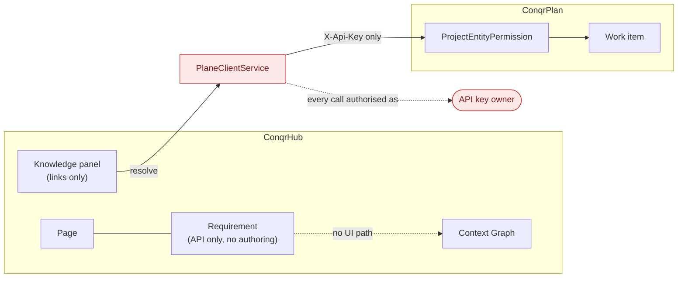
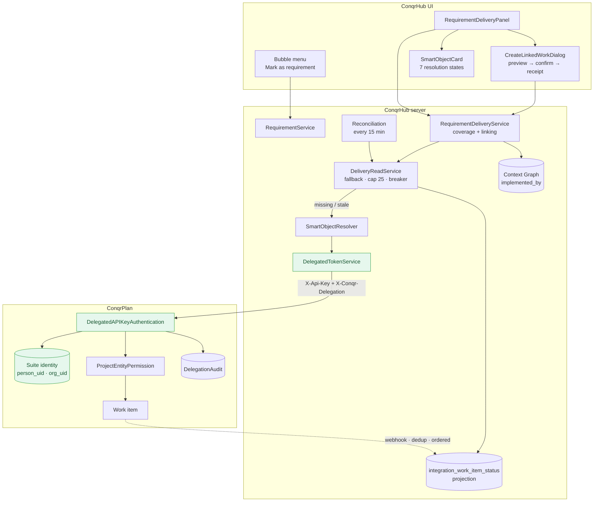
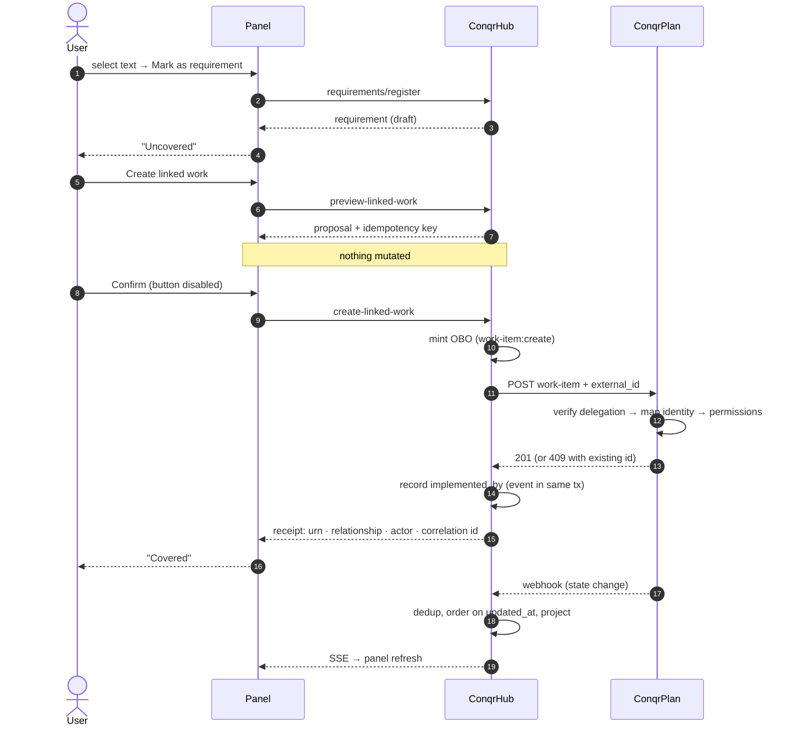

# Vertical Slice 01 — architecture, before and after

## Before

Two products with a bridge that answered as itself, and no user-facing path
between a requirement and the work that delivers it.

**What was wrong**

- Every cross-product read and write was authorised as the `PLANE_API_KEY`
  owner, so any viewer of a Hub page saw the title, state, priority and
  assignees of linked work — including work in projects they had no access to.
- Requirements existed only as API objects: nothing authored them, nothing
  displayed them, nothing showed whether they had delivery behind them.
- Delivery status was resolved live on every render or not at all; there was no
  projection, so a ConqrPlan outage meant an empty panel.

---

## After

**What changed**

| | Before | After |
|---|---|---|
| Identity on a ConqrPlan call | API key owner | The signed-in human, via a signed OBO token |
| Restricted work in the panel | Fully visible | `restricted` card, no metadata |
| Coverage for a viewer who can't see the work | Would read "covered" | **"Uncovered for you"** |
| Requirement authoring | None | Bubble-menu selection → register |
| Delivery status source | Live only | Projection first, live fallback, read repair |
| ConqrPlan outage | Empty panel | Last known state, labelled stale |
| Missed webhook | Permanently wrong | Repaired by a 15-minute sweep |
| Duplicate / late events | Could regress status | Deduped on delivery id, ordered on `updated_at` |

---

## The one flow, end to end

The dashed and numbered paths are the two independent guarantees: the create is
idempotent, so a retry converges rather than duplicating; the event stream is
deduplicated and ordered, so a replay or a late delivery cannot roll status
backwards. There is no distributed transaction anywhere in the diagram, and
none is claimed.
